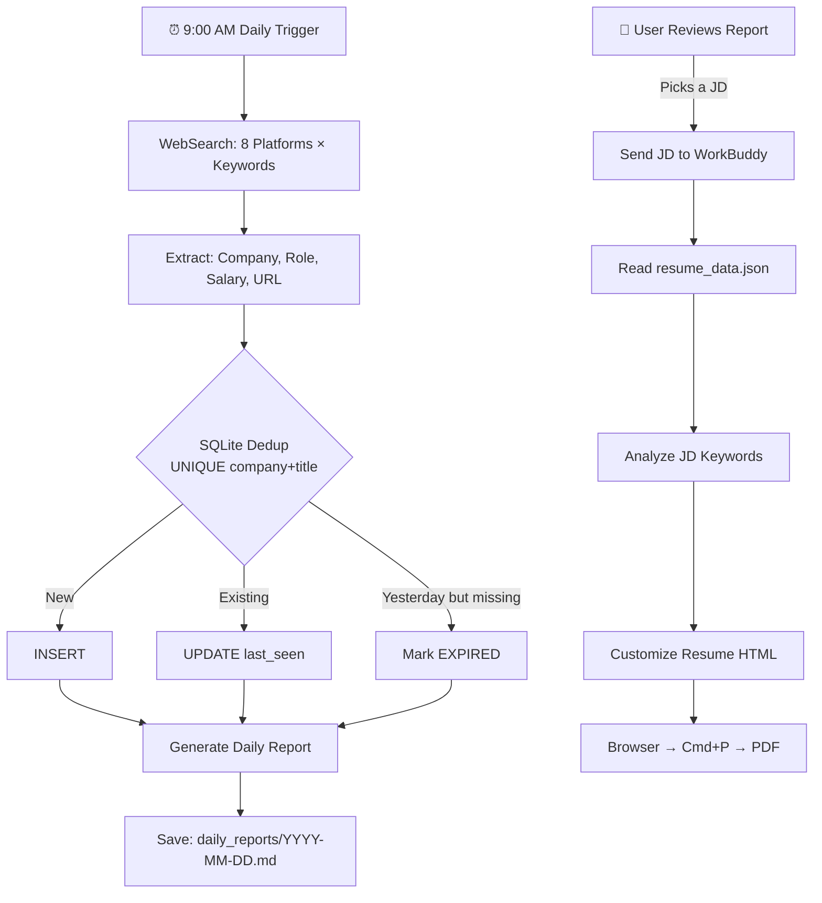

<p align="center">
  
  
  
  
</p>

<h1 align="center">🐺 Job Hunting Daily Search</h1>
<p align="center"><strong>AI-powered multi-platform job search automation for WorkBuddy</strong></p>

---

## What is this?

A **WorkBuddy Skill** that automates your daily job hunt. Every morning at 9:00 AM, it searches **8 major job platforms** across **3 career tracks**, deduplicates results in a SQLite database, tracks changes over time, and generates a structured daily report — all hands-free.

Paired with an AI resume generator: drop in a JD, get a tailored HTML resume back, ready to print as PDF.

---

## ✨ Features

| Feature | Description |
|---------|-------------|
| 🔍 **8-Platform Search** | Boss Zhipin, Liepin, Zhaopin, 51job, LinkedIn, Guopin, Lagou, Maimai |
| 🏷️ **3 Career Tracks** | Internet AI Products, Embodied Intelligence, Enterprise AI Architect |
| 🗄️ **Smart Dedup** | SQLite with `UNIQUE(company, title)` — never see the same job twice |
| 📊 **Change Tracking** | Daily diff: new 🟢 / active 📌 / expired 🔴 |
| 📋 **Top 3 + Overview** | TOP 3 detailed analysis + compact overview table with match scores |
| ⏰ **Recruiter Activity** | Shows when the recruiter was last active ("Active today" > "1 day ago") |
| 📄 **Resume Generator** | JD → keyword analysis → tailored HTML resume → browser → PDF |
| 🤖 **Daily Automation** | Set-and-forget: runs every weekday at 9 AM via WorkBuddy scheduling |

---

## 🚀 Quick Start

### 1. Install the Skill

```bash
# Clone or copy to your WorkBuddy skills directory
cp -r job-hunting-daily-search ~/.workbuddy/skills/
```

### 2. Configure Your Profile

Edit `references/profile.md` (or copy `references/profile_template.md`):

```markdown
## Job Preferences
| Dimension | Criteria |
|-----------|----------|
| Role | AI Product Manager |
| Target Salary | 40K-70K/month |
| Location | Beijing |
| Excluded Companies | MyCurrentEmployer |
```

### 3. Initialize the Database

```bash
python3 scripts/init_db.py --db-path /your/path/jobs.db
```

### 4. Set Up Your Resume

```bash
# Copy and fill in your data
cp references/resume_data_template.json personal_info/resume_data.json
# Edit resume_data.json with your actual information
```

### 5. Create the Daily Automation

In WorkBuddy, create an automation with:
- **Schedule**: `FREQ=WEEKLY;BYDAY=MO,TU,WE,TH,FR;BYHOUR=9;BYMINUTE=0`
- **Prompt**: The search workflow defined in `SKILL.md`

---

## 📁 Project Structure

```
job-hunting-daily-search/
├── SKILL.md                           # WorkBuddy skill definition
├── README.md                          # This file
├── LICENSE                            # MIT
├── .gitignore
├── scripts/
│   ├── init_db.py                     # Initialize SQLite database
│   └── generate_resume.py             # Generate HTML resume from JSON
├── references/
│   ├── profile_template.md            # User profile template (fill in your info)
│   ├── resume_template.html           # HTML resume template ({{placeholders}})
│   ├── resume_data_template.json      # JSON resume data template
│   └── daily_report_template.md       # Daily report format reference
└── assets/                            # Reserved for custom assets
```

### Recommended Runtime Directory

The skill uses a runtime data directory you specify:

```
job-hunting/
├── personal_info/          # Your profile + resume data + template
├── search_config/          # Search criteria
├── daily_reports/          # Daily reports output
├── jds/                    # Saved JDs
├── resumes/                # Generated resumes
└── database/
    └── jobs.db             # SQLite tracking database
```

---

## 🔄 Workflow



---

## 📊 Daily Report Format

Every report has two sections:

### 🎯 TOP 3 — Detailed matches with recruiter activity
```
🥇 1. Company — Role Title
    Salary: 50-80K · 16 months | Match: 92%
    Posted: 2 days ago | Recruiter: Active today
    🔗 https://example.com/job/12345
    💡 Your Agent workflow experience directly maps to this role
```

### 📋 Overview Table — All jobs in one compact view
| # | Company | Role | Salary | Posted | Recruiter | Match | Link |
|---|---------|------|--------|--------|-----------|-------|------|
| 1 | Baidu | AI PM (Agent) | 50-80K | 2d ago | Active today | 92% | URL |

---

## 📄 Resume Customization

**Before (generic resume)** → **After (JD-tailored)**

1. User sends a JD (URL or text)
2. WorkBuddy reads `resume_data.json` (your base data)
3. JD keywords are extracted (Agent, RAG, LLM, multimodal, etc.)
4. Project order is rearranged to prioritize matching experiences
5. Skill tags and summary are adjusted to highlight JD-matching keywords
6. Output: `resumes/Company_Role_Resume.html`
7. Open in browser → **Cmd+P** → Save as PDF

**Template style:** Minimalist single-column, white background, linear layout — optimized for ATS and HR readability.

---

## 🛠️ Scripts

### `init_db.py`
Initialize the job tracking SQLite database.

```bash
python3 scripts/init_db.py --db-path /path/to/jobs.db
```

### `generate_resume.py`
Generate an HTML resume from a JSON data file using the HTML template.

```bash
python3 scripts/generate_resume.py \
  --data personal_info/resume_data.json \
  --template references/resume_template.html \
  --output resumes/my_resume
```

The script auto-opens the result in your browser. Press Cmd+P (Mac) or Ctrl+P (Windows) to save as PDF.

---

## 🔧 Database Schema

Table: `jobs`

| Column | Type | Description |
|--------|------|-------------|
| id | INTEGER PK | Auto-increment |
| company | TEXT NOT NULL | Company name |
| title | TEXT NOT NULL | Job title |
| salary | TEXT | Salary range |
| link | TEXT | Job posting URL |
| platform | TEXT | Source platform |
| first_seen | TEXT | First discovery date (ISO) |
| last_seen | TEXT | Last discovery date (ISO) |
| status | TEXT DEFAULT 'active' | active / expired |
| post_time | TEXT | Job posting time |
| recruiter_active | TEXT | Recruiter last active time |
| match_score | INTEGER | Match score 0-100 |
| match_reason | TEXT | Brief match justification |
| notes | TEXT | Notes |

**Unique constraint**: `UNIQUE(company, title)`

---

## 📦 Requirements

- **WorkBuddy** (the AI assistant platform this skill is built for)
- **Python 3.8+** (for `init_db.py` and `generate_resume.py`)
- **SQLite 3** (bundled with Python)

---

## 🎯 Use Cases

- **Active job seekers**: Automate daily searches, never miss a new posting
- **Passive market monitoring**: Track what's available in your field without daily manual checks
- **Multi-track career exploration**: Run parallel searches across different career directions
- **Resume A/B testing**: Generate tailored resumes for different types of roles

---

## 🤝 Contributing

Contributions welcome! Open an issue or PR on GitHub.

Ways to contribute:
- Add support for more job platforms
- Improve JD keyword extraction
- Add more resume templates
- Add email/push notification integration
- Support additional languages/countries

---

## 📝 License

MIT © 李嘻嘻、大尾巴🐺

---

<p align="center">Made with 🐺 by 李嘻嘻、大尾巴</p>
